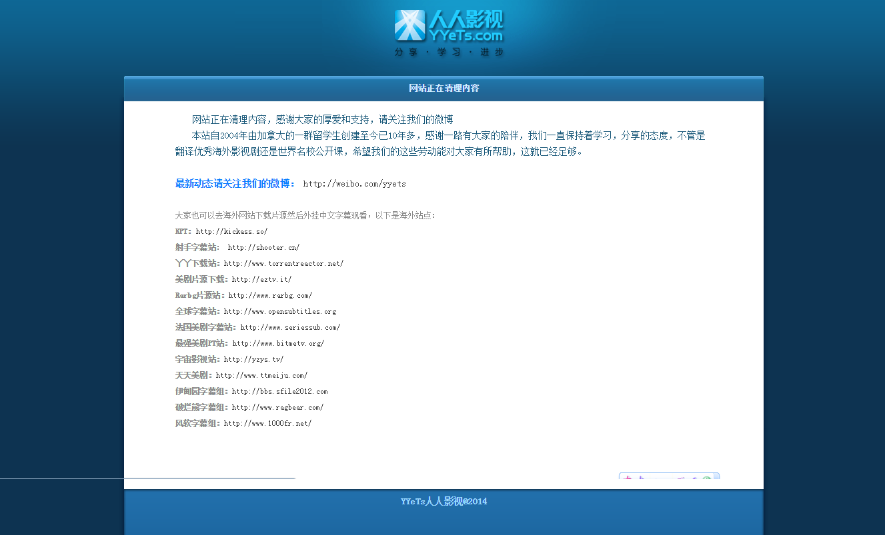
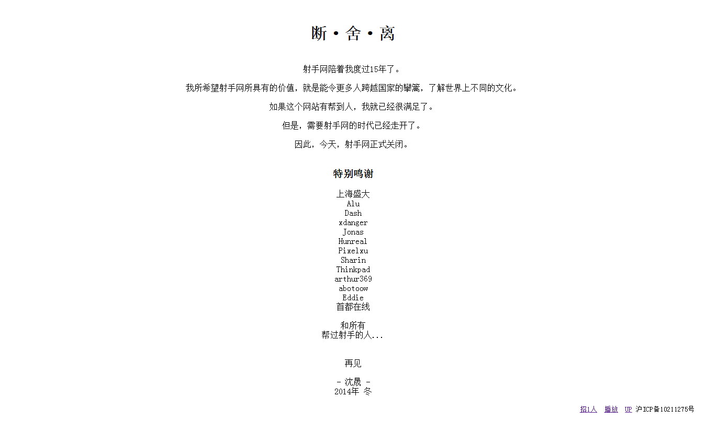

继人人影视之后，射手网成功被广电咔嚓，突然间感到整个世界都不好了，我那些一直在追的美剧啊...

Simplecd只有去年爬的数据，今年实在懒得动了；人人影视代码早在去年写好，也难得爬了。

没有美剧，以后怎么生活呀。

据有童鞋发布消息：“人人影視服務器被封，貼吧消息：昨天人人影视被查封了5台服务器，直接是广电执法部门去查封，人人影视管理团队成员在加拿大无法回来处理，所以服务器直接被扣了。 据说是调查未经授权的影视翻译，意思就是直接要打击字幕组，没有引进的片子不允许翻译中文。还会继续查封其他字幕组和海外影视资源站”。

附上两张图纪念一下，

目前人人影视用国外IP访问正常。

